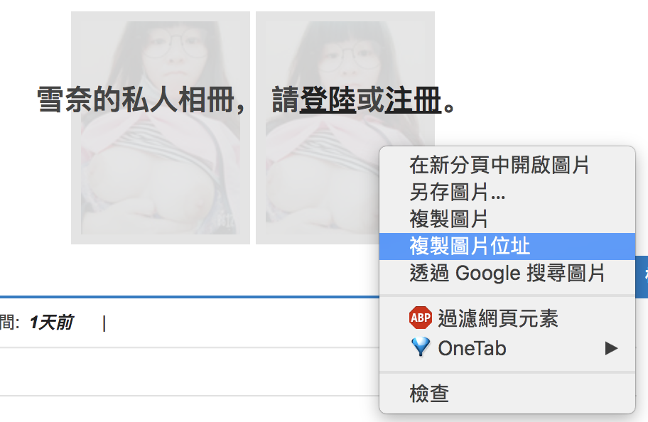
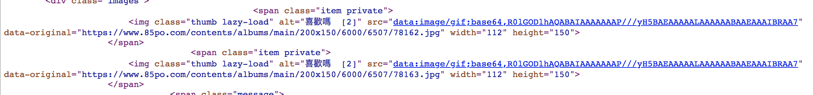
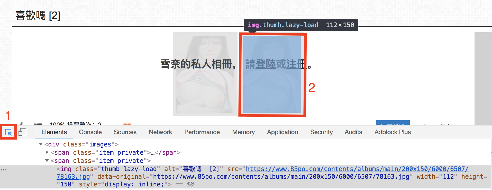
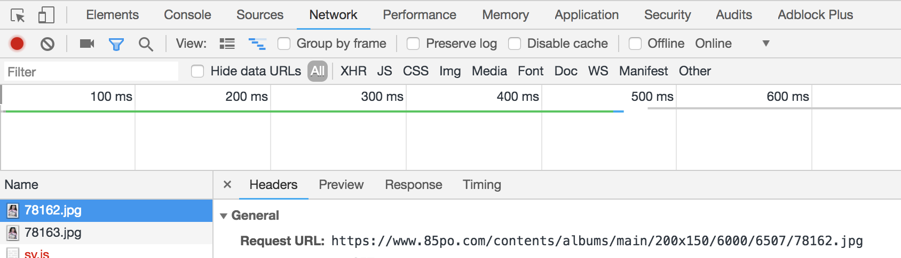

1. [進入此網站](https://www.85po.com/albums/6507/xi-huan-ma5/)

2. 有四個步驟可以取得縮圖網址
	1. 隨便找張圖，按右鍵之後選取「複製圖片位址」
	

	2. 檢查原始碼，搜尋關鍵字.jpg or .png
	
	
	3. 按下F12，使用檢查元素，照著附圖的順序點擊，就可以查到。
	
	
	4. 按下F12，選到網路(Network)之後，重新整理，也可以找到。
	

3. 去找開放圖的網址，發現開放圖是1200x900，把縮圖網址的200x150改成1200x900即可獲得大圖！

4. 一次載該相冊的所有圖片
```javascript

function makeSrcs(srcs) {
    // 搜尋所有的元素
    var imgs = document.getElementsByTagName("img");

    // 每個元素都去查看它的src，如果src裡面有200x150才放進來
    for(var i=0;i<imgs.length;i++) {
        var mysrc = imgs[i].getAttribute("src");
        if(mysrc.indexOf("200x150") >= 0) {
            srcs.push(mysrc);
        }
    }

    // 把最後一個元素踢出去，因為那是頭貼 ._.
    srcs = srcs.slice(0, srcs.length - 1);
}

// 沒啥好講的，就網路上開抄的XD 翻譯一下的話就是..
// 自己創造一個超連結 => 去點超連結(載圖) => 把超連結砍掉
// 以此做出直接把圖片載下來的幻象(因為畫面不會出現超連結)
function downloadImg(mysrc, count) {
    var a = document.createElement('a');
    a.href = mysrc;
    a.download = count + ".png";
    document.body.appendChild(a);
    a.click();
    document.body.removeChild(a);
}

// srcs就是所有圖片的網址, timeout是間隔多久載一張圖
function downloadImgs(srcs, timeout) {
    var count = 0;

    // js提供的function，可以間隔timeout毫秒，執行裡面的function一次
    var myTimer = setInterval(function() { 
        var mysrc = srcs[count];

        // count每timeout毫秒會+1，如果srcs[count]是undefined的話，代表圖片都載完了
        if(typeof mysrc == "undefined") {
            clearInterval(myTimer);
        }
        else {
            // 200x150 => 1200x900
            mysrc = mysrc.replace("200x150", "1200x900");
            downloadImg(mysrc, count);
            count+=1;
        }

    }, timeout);
}

var srcs = [];
makeSrcs(srcs);
downloadImgs(srcs, 1500);

```

